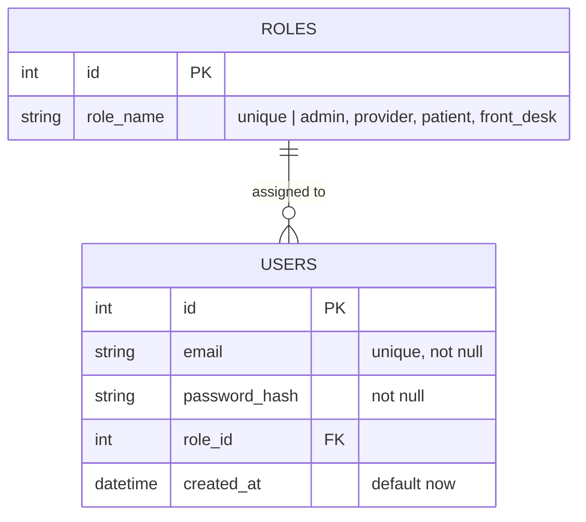
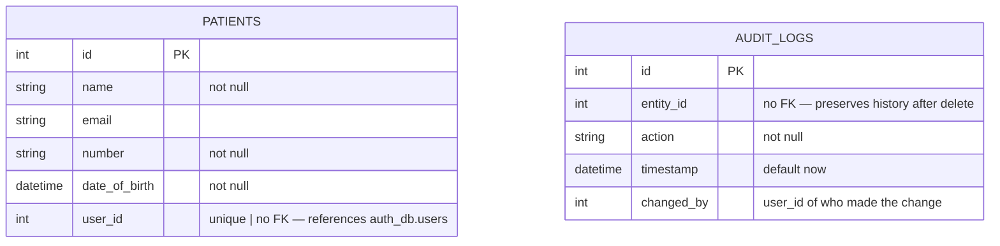
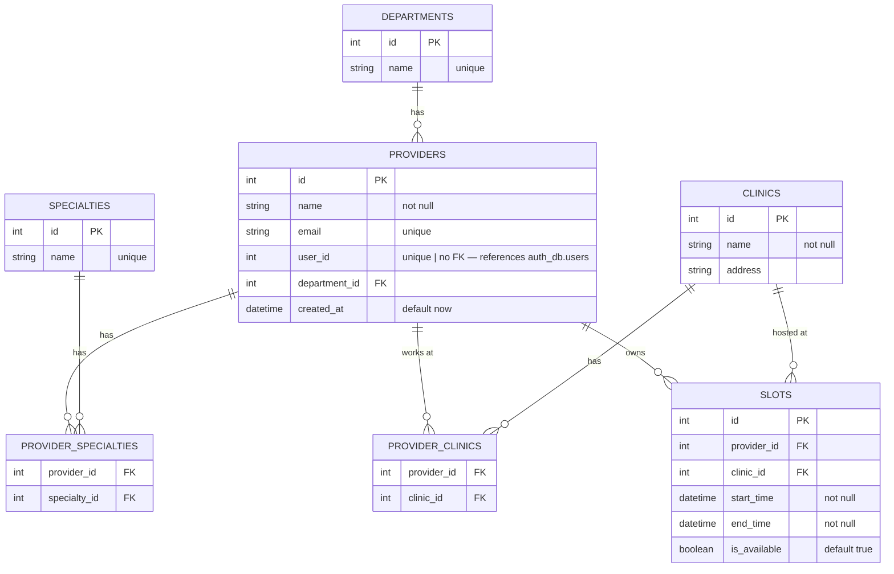

## auth-service → `auth_db`



---

## patient-service → `patient_db`



---

## provider-service → `provider_db`



> **Unique constraint on slots:** `(provider_id, start_time)` — enforced at DB level to prevent double-booking under concurrent requests.

---

## Cross-Service Relationships

```
auth_db.users.id
    │
    ├──▶ patient_db.patients.user_id   (plain int, no FK)
    │
    └──▶ provider_db.providers.user_id (plain int, no FK)
```

**Why no FK?** Postgres cannot enforce foreign keys across databases. Consistency is guaranteed by JWT — a valid token means the user exists in auth-service. No cross-service DB call needed.

---

## Appointment States *(Week 2 — appointment-service)*

```
available ──▶ requested ──▶ confirmed ──▶ complete ──▶ unavailable
                  │               │
                  ▼               ▼
              cancelled       no_show
```

`appointments` table will hold a `status` column with these values. Slot `is_available` is separate — it tracks bookability, not appointment outcome.
