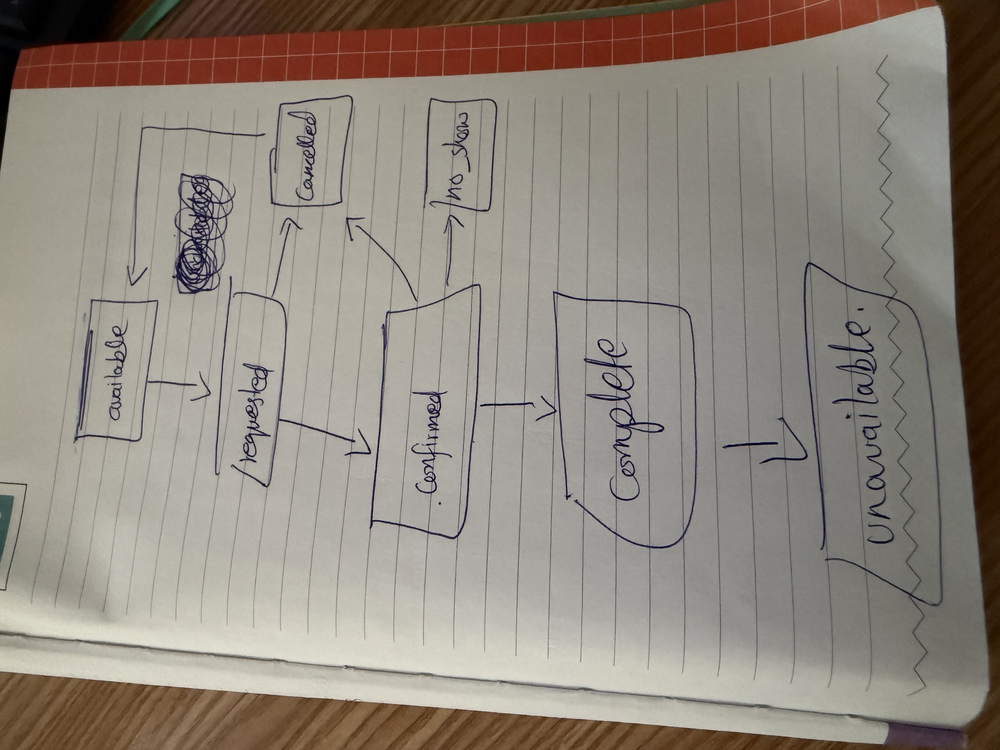
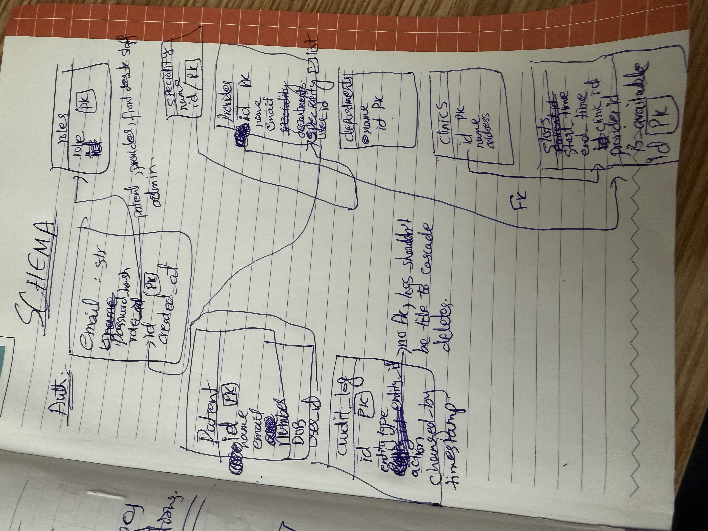

1- Separate Postgres containers vs one container with 3 isolated DBs?

i went with seperate containers per service. this way the DBs are not relying on each other. no single point of failure. difficult to manage as a bigginer, but from learning perspective i'll get to learn about inter-containers connections. also, a single DB for all microservices kills the main point of having MSs. (i read about connection poolers (pgbouncer) for limited connection at a time to db per service.)

2- Monorepo vs polyrepo?

i chose to store the MSs in a monorepo. polyrepos are difficult manage. plus the current project is a short assignment. within the monorepo i have kept the dockerfiles for each service seperat. a single shared docker-compose will setup everything instead of setting up each MS in a seperate repo and it will also make inter-service networking easy as all the containers are on the same docker network here. decreases project setup overhead.

3- Why these 3 services? Why is appointments a future 4th and not inside patient-service?

for starting i think 3 services would be enough for hands on practice. appointments have their own different flows so it should have its own MS. also it is not only connected to patient, the provider also has a relation with it. also, this will contain scheduling logic (temporal workflow) and it can be scaled, replaced and restarted independently without modyfying patient opr procider data.

4- Is a patient a user? Patient has user_id but no FK across DBs, how do you keep it consistent?

yes, a patient is a user. any person/account using the smart health system has to go through auth first and w.r.t. that everyone is a user. the user_id in patient is in refrence to the id in auth table. since the DBs of both these services are isolated, in this case i will be trustung the jwt. when a patient creation request will comes, teh jwt will already prove that the user exists (auth service issues the jwt). the user id will be extracted from the jwt and stored in patient tabble against that patient.

5- Double-booking prevention, unique constraint on (provider_id, start_time) in slots table,  why is that better than an if slot_taken check in code?

the unique constrait will terminate the query as soon as the commit is initiated, an error will be thrown. it will avoid race condition. also the slot_taken check would required me to loop throgh all the slots and compare client and slot strat time of each record to the newly added one, increasing execution time and complexity.

6- Appointment state machine: 

7- DB schema: 

8- transitions for appointment status
requested -> confirmed / cancelled / failed
confirmed -> checked_in / cancelled / no_show
checked_in -> in_progress / cancelled
in_progress -> completed / cancelled